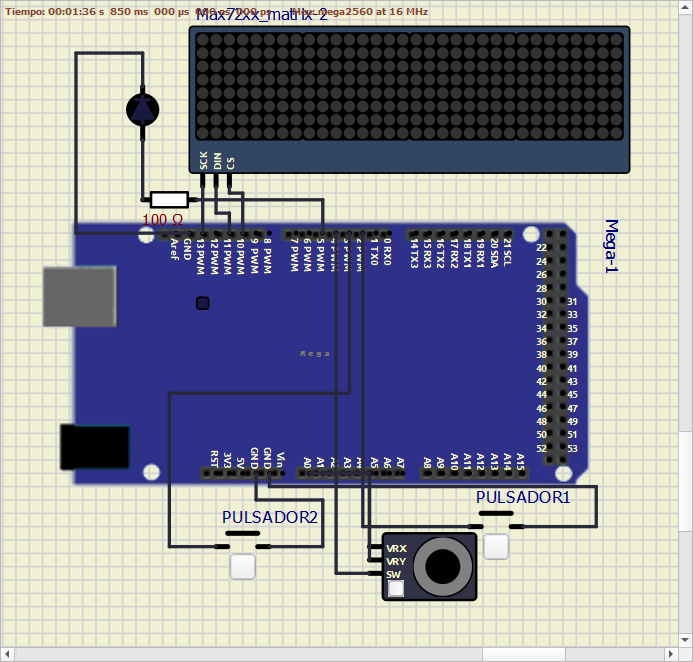

## Introducción

Esta ejercicio muestra la programación de sistemas en C con Arduino,mediante el uso del programa Arduino IDE.

El Teleskecht es el nombre de un antiguo juguete de los años 80. Consistíaen una pizarra/pantalla, donde con la ayuda de dos ruedas (una para el eje Xy otra para el eje Y) se movía una especie “lápiz” en el interior y dibujaba unalínea. Al sacudir la pantalla con energía podías borrar lo que había en ella.Más tarde salieron nuevas marcas y modelos más modernos. Nosotros lo reproduciremos con una matriz de leds, un joystick y dos pulsadores.
Para ello utilizaremos el siguiente periférico:

- Matriz de leds. Matriz de 32x8 leds construida a partir de cuatro módulosde 8x8 leds basados en el controlador
MAX7219 con bus serie SPI.

Además de su respectiva biblioteca recomendada por el fabricante
MD_MAX72XX.

## Objetivos

Los objetivos pedidos para esta práctica son los siguiente:

- Crear una pantalla mágica con la ayuda de una matriz de leds de 32x8.Las señales CLK, DIN y CS se conectarán a los pines 13, 11 y 10,respectivamente.

- Dibujar en la matriz de leds con la ayuda de un joystick analógico. Lasseñales X, Y, KEY se conectarán a los pines A0, A1 y 4, respectivamente.
 
- Tendrá un LED aparte conectado a una resistencia de 1Kohm que nosindicará en que modo está el programa, se conectará al pin 5.
  
- En el modo desplazamiento el LED estará apagado, la matriz de ledsmostrará la posición actual mediante el parpadeo (2 Hz) del led actual. Almover la palanca de mando desde su posición de reposo en cualquierdirección, se cambiará la posición actual. Cuando se pulse el botón de lapalanca de mando, se conmutará el estado del led actual de la matriz (si estaba encendido se apagará, si estaba apagado se encenderá).

- Al pulsar el botón 1 (PIN 2), se pasará al modo de dibujo (led 1 encendidofijo). En este modo, la matriz de leds mostrará la posición actualmediante el parpadeo (a 2 Hz) del led actual. Al mover la palanca demando desde su posición de reposo en cualquier dirección, se cambiarála posición actual y se encenderán todos los leds de la matriz desde laposición original hasta la actual. Al volver a pulsar el botón 1, se volveráal modo de desplazamiento.

- Al pulsar el botón 2 (PIN 3), se pasará al modo de borrado (led 1encendido con parpadeo a 1 Hz). En este modo, la matriz de ledsmostrará la posición actual mediante el parpadeo (a 2 Hz) del led actual.Al mover la palanca de mando desde su posición de reposo en cualquierdirección, se cambiará la posición actual y se apagarán todos los leds dela matriz desde la posición original hasta la actual. Al volver a pulsar elbotón 2, se volverá al modo de desplazamiento.

- El recorrido de la palanca de cambio en cualquier dirección se dividirá en5 zonas iguales. La primera zona, alrededor de la posición de reposo de lapalanca de mando, no realizará ninguna acción. Un movimiento de lapalanca de mando desde la primera zona a la segunda, tercera, cuarta oquinta zona en cualquier dirección producirán un movimiento de 1, 2, 3 o4 unidades en la dirección correspondiente. Debe ser posible realizarmovimientos ortogonales y diagonales.

## Desarrollo

### Esquema credao en SimulIDE:

### Pseudocodigo:

Primero incluimos la biblioteca MD_MAX72xx.h que nos permite operar conla matriz de leds. Definimos todos los pines que vamos a necesitar segúnnos piden en los objetivos. Para la matriz de leds CLK, DIN, CS. Para eljoystick VRX, VRY, SW. Para los pulsadores 1 y 2 dos pines (2 y 3respectivamente) y para finalizar uno para el LED que irá en el pin 5.

Creamos las variables necesarias que se compondrán básicamente de variosestados booleanos con sus previos. También creamos variables para losintervalos en que parpadearán los leds y para crear las zonas en las que sedesplazará el cursor. Las variables X e Y serán muy importantes ya que nosdirán donde está el cursor de la matriz. Creamos la variable mode que será 0 de inicio.

A continuación, creamos las funciones que necesitaremos para nuestrocódigo:

- __Función int Zonas(int zona):__
Con las 5 zonas que dividen los 512 valoresdel joystick (100 cada una aprox.) creadas en las variables al principio,según la zona en la que se encuentre el joystick, devolverá valores 0, 1, 2,3 ó 4.

- __Función void Lecturajoystick():__
Necesitamos una función que lea elestado del joystick (pines A0 y A1) para definir lo que será arriba, abajo,izquierda y derecha. Gracias a la función Zonas(), según lo que giremos lapalanca del joystick nos devolverá un valor u otro, que será lo queavanzará el cursor. Todo esto va dentro de un condicional que no dejaque hagas más movimientos hasta que vuelvas a la zona de reposo(DEAD_ZONE). También definiremos el límite de los bordes de la matrizpara que no vaya más allá.

- __Función void LedParpadeo(int LED, int tiempo):__
Crearemos una funcióncon el método millis() que nos permite elegir el led y el intervalo con laque queremos que parpadee.

Ahora definiremos las funciones de los distintos modos:

- __Función void ModoDesplazamiento():__
Esta función usa el método millis()para el parpadeo del led de la matriz. Incorporamos la funciónLecturaJoystick() para que nos de hacia donde se desplazará el cursor enX e Y además de la cantidad de leds que avanzará. Con los métodossetPoint() y getPoint() de la biblioteca MAX72xx y unas variables previasde X e Y logramos que recuerde el estado previo y los respete.

- __Función void ModoDibujo():__
Esta función usa el método millis() para elparpadeo del led de la matriz. Incorporamos la función LecturaJoystick()para que nos diga hacia donde se desplazará el cursor en X e Y, ademásde unas variables previas que recuerden el estado anterior. Incorporatambién la función dibujar_linea_bresenham() que poniendo “true” nospermite encender los leds por donde pasa el cursor.

- __Función void ModoBorrado():__
Esta función usa el método millis() para elparpadeo del led de la matriz. Incorporamos la función LecturaJoystick()para que nos diga hacia donde se desplazará el cursor en X e Y, ademásde unas variables previas que recuerden el estado anterior. Incorporatambién la función dibujar_linea_bresenham() que poniendo “false” nospermite apagar los leds por donde pasa el cursor.

- __Función dibujar_linea_bresenham():__
Esta función detecta los estadosprevios de X e Y y los actuales. Con “true” o “false” encenderá o apagarálos leds desde punto previo al actual.

- __Función PulsarBoton():__
creamos una función que lea el estado actual yprevio de cada botón y entre en el modo pedido en los objetivos.

En la sección de _setup()_, iniciaremos todos los pines definidos para la matrizde leds (CLK, DIN, CS), joystick (VRX, VRY, SW), botones 1 y 2 (PINES 2 y 3), led(PIN 5), las funciones begin() y clear().

En la sección _loop()_, creamos variables que lean los estados del botón 1 y 2.Llamamos a las funciones PulsarBoton(), si detecta que se ha presionado entrará en mode 1 (dibujo, pulsador 1) o en mode 2 (borrado, pulsador 2). Sivolvemos a presionar el botón entraremos en mode 0 (desplazamiento).Después creamos otro condicional que según el modo en el que estemosllame a las funciones creadas ModoDesplazamiento(), ModoDibujo() yModoBorrado() junto con sus estados en el led, apagado para mode 0,encendido para mode 1 y parpadeo a 1 Hz para mode 2. Solo en mode 0,ponemos un condicional que al presionar el botón del joystick se enciendael led de la matriz donde este el cursor, si estaba encendido lo apagará.

## Conclusiones

La matriz de leds MAX72xx es un elemento nuevo con el que hemos tenidoque trabajar y recopilar información sobre su funcionamiento. Esta matrizes muy usada en la vida real gracias a que se visibilidad desde lejos es muybuena, ejemplos serían los carteles de las farmacias, en las obras o de la DGT.

Nos hemos encontrado varios problemas al realizar la práctica, siendo losprincipales:

- que respete los estados del resto de leds en la matriz al pasar elcursor por encima (ModoDesplazamiento).
- Crear la funciónlínea_de_bresenham, hemos necesitado ayuda en la red para crear estealgoritmo.
-  Conseguir que el cursor solo mueva una vez hasta que la palancadel joystick vuelva a la DEAD_ZONE también nos ha costado mucho.
 
Nos ha gustado mucho realizar este proyecto, tanto por su desafío queconlleva, como por su tema juego/creatividad. Al aprender a usar la matrizde leds, nos ha dado ideas para posibles proyectos en el futuro.
